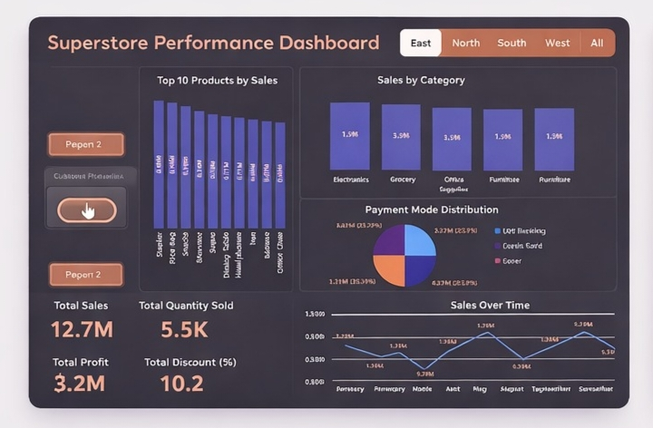
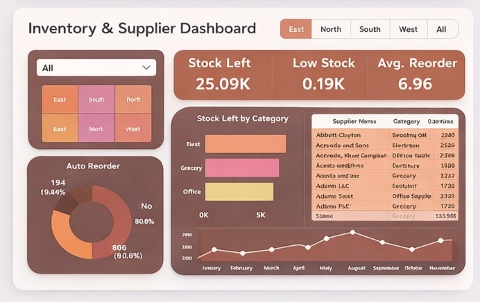
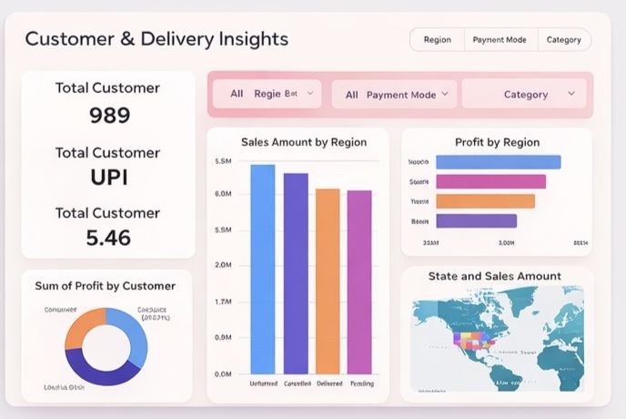
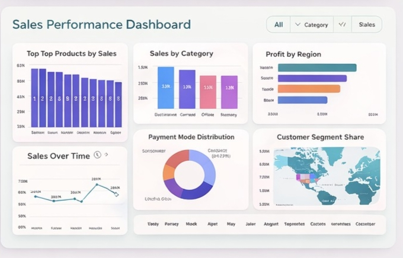

# 📊 EDA Superstore Dashboard Project

---

## 🚀 Project Overview

This project performs **Exploratory Data Analysis (EDA)** on Superstore data and builds **interactive dashboards** to uncover business insights.

It focuses on analyzing **sales, profit, customer behavior, and inventory performance** to support better decision-making.

---

## ⭐ Key Highlights

* 📊 Built **4 interactive dashboards**
* 📈 Performed complete **EDA using Python**
* 💡 Identified **profit loss areas & high-performing categories**
* 📉 Analyzed **impact of discounts on profit**
* 🧠 Improved **data storytelling & visualization skills**

---

## 📌📊 Dashboard Preview

### 🔹 Superstore Performance Dashboard

* Top 10 Products by Sales
* Sales by Category
* Payment Mode Distribution
* Sales Over Time

---

### 🔹 Inventory & Supplier Dashboard

* Stock Left & Low Stock Items
* Auto Reorder Analysis
* Supplier Performance
* Reorder Trends

---

### 🔹 Customer & Delivery Insights

* Customer Segmentation
* Sales by Region
* Profit Analysis
* Delivery Insights

---

### 🔹 Sales Performance Dashboard

* Top Products Analysis
* Category-wise Sales
* Profit by Region
* Sales Trends

---

## 🛠 Tech Stack

* 🐍 Python (Pandas, NumPy)
* 📊 Matplotlib & Seaborn
* 📈 Power BI
* 📓 Jupyter Notebook

---

## 📁 Project Structure

EDA-Superstore-Dashboard/
│── README.md
│── EDA_Superstore.ipynb
│── data_generator.ipynb
│── Superstore_Management_System.csv
│── eda_analysis_summary.csv
│── superstore_dashboard.png
│── inventory_dashboard.png
│── customer_dashboard.png
│── sales_dashboard.png

---

## 📈 Key Insights

* 🏆 Technology category generates highest sales
* ⚠️ High discounts reduce profit margins
* 🌍 Some regions show high sales but low profit
* 📦 Inventory needs optimization for better efficiency

---

## 💡 Business Recommendations

* Reduce excessive discounting strategies
* Focus on high-profit product categories
* Improve inventory planning system
* Target low-profit regions for optimization

---

## 🎯 Project Outcome

This project enhanced my ability to:

* Perform **real-world data analysis**
* Build **interactive dashboards**
* Generate **business-driven insights**
* Communicate findings effectively

---

## 📂 Dataset

Superstore dataset (CSV format)

---

## 📬 Contact

* 🔗 GitHub: https://github.com/poojakalloli
* 🔗 LinkedIn: https://www.linkedin.com/in/pooja-kalloli/

---

## 👩‍💻 Author

**Pooja Kalloli**
🚀 Aspiring Data Analyst
